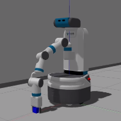

# README for TECHIN517 Milestone 1

## Main code repo
Please check out the **[GitHub Page](https://github.com/ironmanyu/Laundry_and_Garbage_Collection/tree/team_main)**

## Main Branch
**team_main**

## Code related to milestone 1
**[milestone1.py](https://github.com/ironmanyu/Laundry_and_Garbage_Collection/blob/team_main/scripts/milestone1.py)**

# Instruction on how to run (Please read carefully)

## 1.  Execute following command in your favorite terminal (Or what ever command you need to get the project environment to launch)
```
roslaunch robotic_labs project_env.launch 
```

## 2.  Execute following command in your favorite terminal (Or what ever command you need to get the move_group motion planner to run)  

### **IMPORTANT NOTE:** I'm using a customized fetch moveit file which has octo map enabled and tuned specificly to my environment. Do **NOT** expact by just running my code will gives the active obstacle avoidence. Only run the code in simulation or there is a chance crash into something
```
roslaunch fetch_moveit_config move_group.launch
```

## 3.   Adding an demo_cube from fetch_gazebo package to the see and use any tool (e.g. motion planning rviz plugin) to move the arm into the following initial position


## 4.   Execute **[milestone1.py](https://github.com/ironmanyu/Laundry_and_Garbage_Collection/blob/team_main/scripts/milestone1.py)**
### **IMPORTANT NOTE and DISCLAMER:** I'm using a customized ompl configuration specificlly tuned for my environment (Due to the size I won't be able to upload it). Which allows joint space orientation constrain being used to enforce the verticle end-effector pose as you can see in the video. Do **NOT** expect my code's behavior on other environment is as good as the video.(Basically there is a chance a jerky motion happens during planning) Contact me for detail and I can do a live demo if needed(It guaranteed end-effector orientation on my tuned environment but not on other).

## 5.   Watch and enjoy the amazing move  

  
# Youtube Video Link
## **[Milestone1 short version](https://youtu.be/kIy_dX4ovQM)**
## **[Milestone1 long version](https://youtu.be/m2LNHfqIK_U)**
