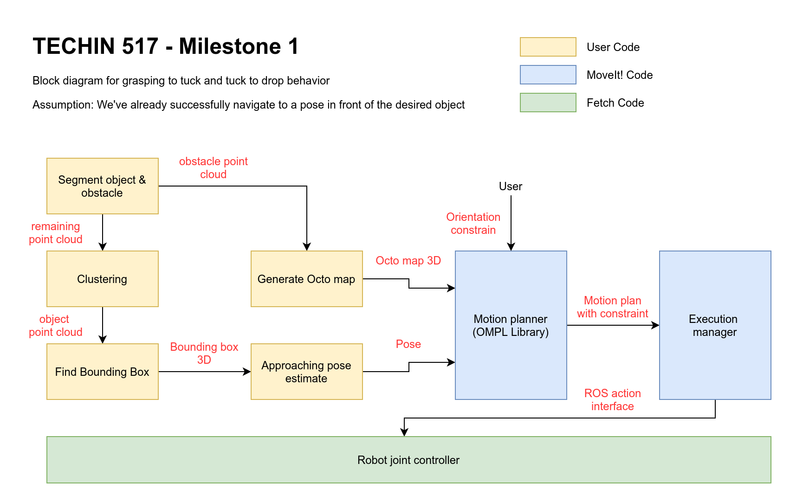
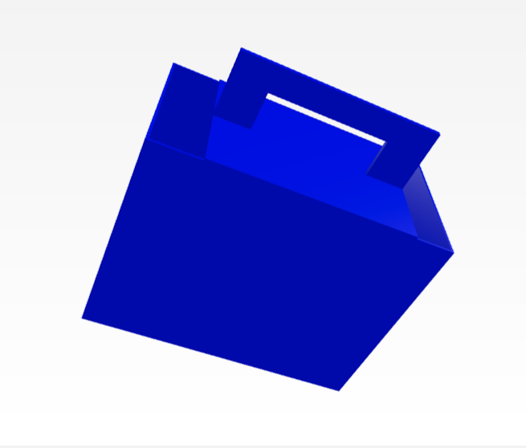
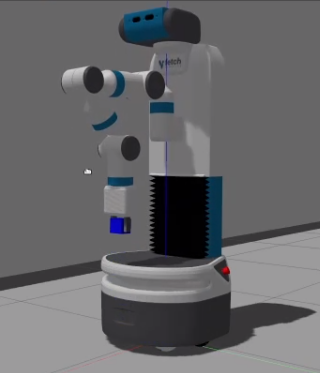

# Workflow diagram and decision criteria

## Workflow diagram

## Decision criteria
### 1.  Shape of the load
We defined our load shape to be a paper bag with a large reinforced handle. 3D model is made for simulation purpose.
**Bag**   

### 2.  Weight of the load
We defined our load weight to be near to nothing this is due the limitation of fetch's servos.
### 3.  Collision avoidence in motion planning
An octo map (Based on segmented obstacle point cloud)is used to provide obstacle avoidence during motion planning  
**Segmentation**  
  
**Octo map**  
  
### 4.  Arm tuck pose after grasping
Tucked pose need to not blocking laser and head camera. (Will be done with visual constraint in future, right now is hard coded). It also need to consider movement stability (we will need to test on the physical robot soom)
**Octo map**  
  
### 5.  Approaching pose
Approaching pose need to be a bit higher than the target object to avoid collide into it
### 6.  End-effector orientation constrain after successful grasping
End-effector is constrained to pointing verticle downward with a tolerance of 0.1 rad all the time. Implemented with orientation constraint and joint space sample rejector.